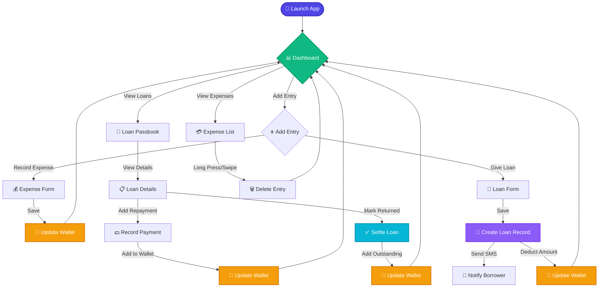
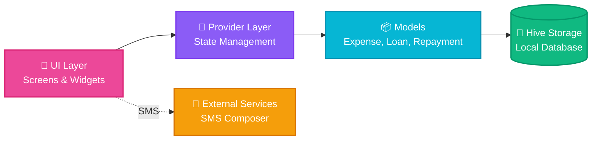
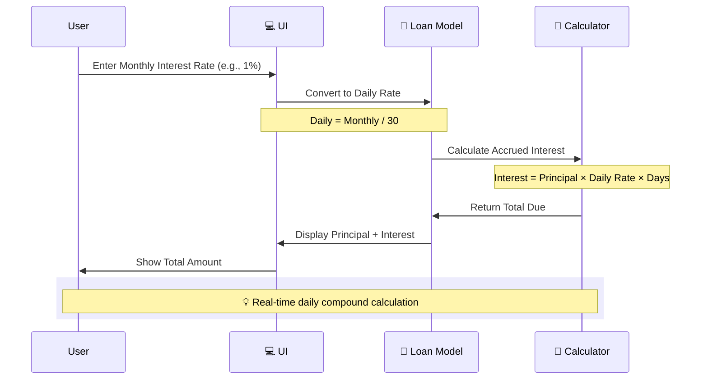
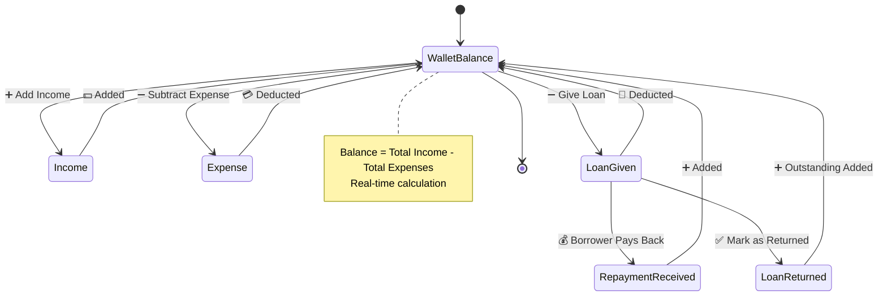

# 💰 Personal Expanse Tracker

<div align="center">


### 🎯 Your Personal Finance & Loan Management Companion

*Track expenses, manage loans, and watch your wealth grow with style!*

[Features](#-features) • [Screenshots](#-screenshots) • [Installation](#-installation) • [Architecture](#-architecture) • [Contributing](#-contributing)

</div>

---

## ✨ Features

<table>
<tr>
<td width="50%">

### 💸 **Expense Tracking**
- ✅ Record income & expenses
- 📊 Real-time wallet balance
- 🎨 Beautiful dashboard with visual insights
- 🗑️ Quick delete with swipe or tap
- 📅 Categorized transactions

</td>
<td width="50%">

### 🤝 **Loan Management**
- 💰 Track money lent to friends
- 📈 Automatic daily interest calculation
- 📱 SMS notifications to borrowers
- 💵 Repayment tracking
- ✅ Mark loans as returned

</td>
</tr>
</table>

---

## 🎬 How It Works



---

## 🏗️ Architecture



### 📂 Project Structure

```
lib/
├── 📱 main.dart                 # App entry point
├── 🎨 app.dart                  # Material theme & routing
├── 📦 models/
│   ├── expense.dart             # Expense data model
│   ├── loan.dart                # Loan data model
│   └── repayment.dart           # Repayment data model
├── 🖼️ screens/
│   ├── home_screen.dart         # Bottom nav & tabs
│   ├── expenses_screen.dart     # Wallet dashboard
│   ├── loans_screen.dart        # Loan passbook
│   ├── loan_detail_screen.dart  # Individual loan view
│   └── add_expense_screen.dart  # Add entry form
├── 🔧 services/
│   ├── db_service.dart          # Database operations
│   └── notification_service.dart # Push notifications
└── 🎯 widgets/
    └── expense_tile.dart        # Reusable components
```

---

## 💡 Core Concepts

### 🧮 Interest Calculation Logic



### 💰 Wallet Flow



---

## 🚀 Installation

### Prerequisites

```bash
# Check Flutter installation
flutter doctor

# Required:
✅ Flutter SDK >= 3.9.0
✅ Dart >= 3.0.0
✅ Android Studio / VS Code
✅ Android SDK / Xcode (for iOS)
```

### 📥 Setup Steps

1️⃣ **Clone the repository**
```bash
git clone https://github.com/Anshukumar0112/Expanse_Tracker.git
cd personal_expanse
```

2️⃣ **Install dependencies**
```bash
flutter pub get
```

3️⃣ **Generate model adapters**
```bash
flutter pub run build_runner build --delete-conflicting-outputs
```

4️⃣ **Run the app**
```bash
# For Android
flutter run

# For iOS
flutter run -d ios

# For specific device
flutter devices
flutter run -d <device-id>
```

---

## 🎨 Screenshots

<div align="center">

### 📊 Dashboard & Wallet
*Real-time balance tracking with beautiful gradient cards*

### 💸 Add Expense/Loan
*Intuitive forms with income/expense toggle*

### 🤝 Loan Passbook
*Track all loans with interest calculation*

### 💵 Loan Details & Repayments
*Detailed view with repayment history*

</div>

---

## 🛠️ Tech Stack

| Technology | Purpose |
|-----------|---------|
| 🎯 **Flutter** | Cross-platform UI framework |
| 🎨 **Material 3** | Modern design system |
| 💾 **Hive** | Fast, local NoSQL database |
| 🔄 **Provider** | State management |
| 📱 **URL Launcher** | SMS integration |
| ✍️ **Google Fonts** | Typography (Inter) |
| 📅 **Intl** | Date/currency formatting |
| 🆔 **UUID** | Unique identifiers |

---

## 📊 Data Models

### 💳 Expense Model
```dart
class Expense {
  String id;           // Unique identifier
  String title;        // Transaction name
  double amount;       // Money value
  String category;     // Category tag
  DateTime date;       // Transaction date
  bool isLoan;        // Is this a loan marker?
  bool isIncome;      // Income vs Expense
}
```

### 🤝 Loan Model
```dart
class Loan {
  String id;                    // Unique identifier
  String borrowerName;          // Who borrowed
  String? borrowerPhone;        // Contact number
  double amount;                // Principal amount
  DateTime loanDate;            // Start date
  DateTime dueDate;             // Return date
  double dailyInterestPercent;  // Daily interest rate
  bool isReturned;             // Settlement status
  DateTime? returnDate;         // Actual return date
  
  // Calculated properties
  double accruedInterest();    // Interest earned so far
  double totalDue();           // Principal + Interest
}
```

### 💵 Repayment Model
```dart
class Repayment {
  String id;          // Unique identifier
  String loanId;      // Parent loan reference
  double amount;      // Payment amount
  DateTime date;      // Payment date
  String remarks;     // Optional notes
}
```

---

## 🎯 Key Features in Detail

### 🔢 Interest Calculation

- **Input**: Monthly interest percentage (user-friendly)
- **Storage**: Converted to daily rate (monthly / 30)
- **Calculation**: Simple daily interest
  ```
  Interest = Principal × Daily Rate × Days Elapsed
  Total Due = Principal + Interest
  ```
- **Display**: Shows both daily and monthly equivalent

### 💼 Wallet Management

| Action | Effect on Wallet |
|--------|-----------------|
| ➕ Add Income | Balance increases |
| ➖ Add Expense | Balance decreases |
| 💸 Give Loan | Balance decreases (loan out) |
| 💰 Receive Repayment | Balance increases |
| ✅ Mark Loan Returned | Outstanding amount added to balance |

### 📱 SMS Integration

When creating a loan:
```
Hi [Borrower],
You received ₹[Amount] from me on [Date].
Monthly interest: [X]% (calculated daily)
Due by: [Due Date]
```
Opens native SMS composer with pre-filled message.

---

## 🎨 Design Highlights

- ✨ **Material 3** design language
- 🎨 **Google Fonts** (Inter) for modern typography
- 🌈 **Color-coded** transactions (green = income, red = expense, orange = loan)
- 💫 **Smooth animations** and transitions
- 📱 **Responsive** layout for all screen sizes
- 🌙 **Dark mode** ready (future enhancement)

---

## 🔮 Future Enhancements

- [ ] 📊 Advanced analytics & charts
- [ ] 🔔 Push notifications for due dates
- [ ] 📤 Export to CSV/PDF
- [ ] ☁️ Cloud sync across devices
- [ ] 🔐 Biometric authentication
- [ ] 💱 Multi-currency support
- [ ] 🎯 Budget goals & limits
- [ ] 📈 Investment tracking
- [ ] 🌙 Dark mode theme
- [ ] 🌍 Localization (multiple languages)

---

## 🤝 Contributing

We welcome contributions! Here's how you can help:

1. 🍴 Fork the repository
2. 🌿 Create a feature branch
   ```bash
   git checkout -b feature/amazing-feature
   ```
3. 💾 Commit your changes
   ```bash
   git commit -m "Add amazing feature"
   ```
4. 📤 Push to the branch
   ```bash
   git push origin feature/amazing-feature
   ```
5. 🎉 Open a Pull Request

---

## 📝 License

This project is licensed under the MIT License - see the [LICENSE](LICENSE) file for details.

---

## 👨‍💻 Developer

<div align="center">

**Anshu Kumar**

[](https://github.com/Anshukumar0112)

*Built with ❤️ using Flutter*

</div>

---

## 🙏 Acknowledgments

- 🎨 [Material Design](https://material.io/) for design guidelines
- 📦 [Hive](https://docs.hivedb.dev/) for blazing-fast local storage
- 🎯 [Flutter Community](https://flutter.dev/community) for amazing packages
- 💡 All contributors who helped shape this project

---

<div align="center">

### ⭐ Star this repo if you find it helpful!

**Made with 💰 for better financial management**

</div>
